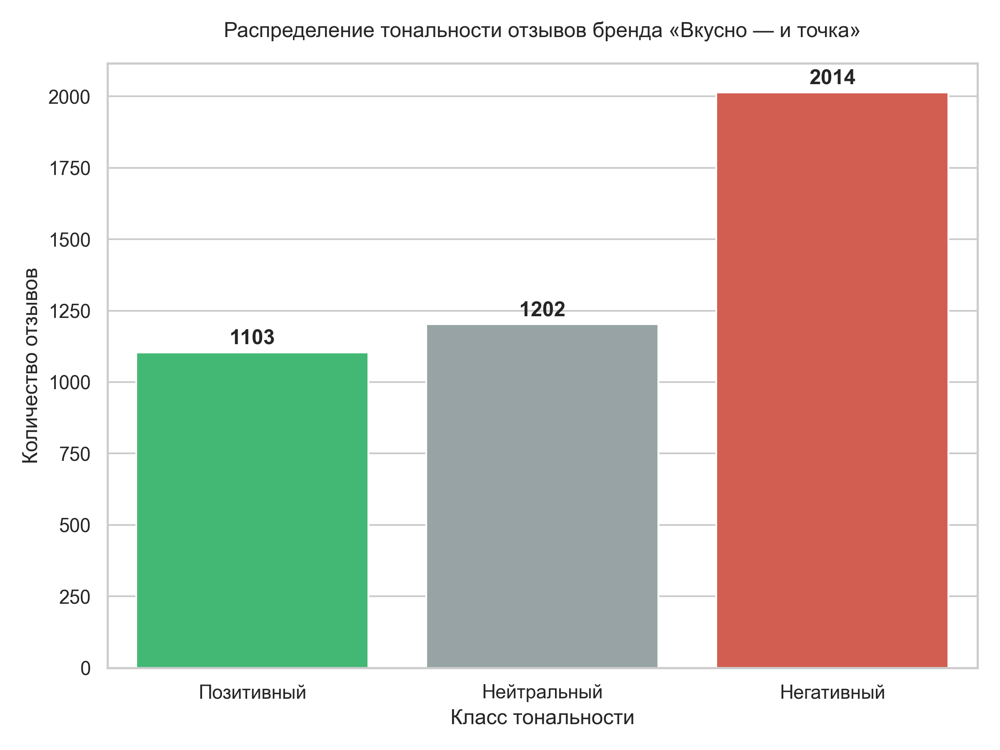

# ViT_sentiment_analysis
ИТ - конвейер анализа отзывов "Вкусно - и точка" в Санкт - Петербурге
# Интеллектуальный анализ ORM-показателей бренда «Вкусно — и точка» в Санкт-Петербурге

Сквозной ИТ-конвейер (Data Pipeline) полного цикла (Data Engineering & MLOps) для автоматизированного сбора, нейросетевого анализа тональности отзывов и интерактивной BI-визуализации по 87 филиалам торговой сети.

## 🛠 Стек технологий и архитектура
* **Сбор данных:** Python, Selenium, `undetected_chromedriver` (модуль `Parser_ViT_3.py`) — обход антифрод-систем и парсинг геосервисов.
* **ИИ-инференс:** PyTorch, RuBERT (модель `seara/rubert-base-cased-russian-sentiment`, модуль `sentiment_analysis_ViT_3.py`) — пакетная обработка (Batch=16) с GPU-оптимизацией.
* **Трансформация и NLP:** RegEx, Pandas, Matplotlib, Seaborn (модуль `visualize_result_ViT_3.py`) — очистка текста, восстановление пропущенных рейтингов (Data Imputation).
* **Бизнес-аналитика:** Power BI (файл `Дашборд_итоговый проект.pbix`) — реляционная модель данных «Звезда» (1:*).

## 📂 Структура входных данных
* `restaurants.xlsx` — конфигурационный справочник-база по 87 филиалам Санкт-Петербурга. Вынесение конфигурации из кода обеспечивает масштабируемость системы на другие регионы ритейла без изменения программных модулей.

## 📊 Результаты лингвистического анализа (Python)
По результатам инференса нейросети RuBERT из 4319 собранных отзывов **доля негатива составила 46,6%** (2014 отзывов).

  
  

* **Ключевые маркеры боли клиентов:** 
  * *«минут», «долго»* — системный кризис скорости обслуживания в пиковые часы.
  * *«в итоге», «не положили»* — критические ошибки комплектации заказов на вынос и в доставку.
  * *«кофе»* — локальные технические сбои и необходимость калибровки кофейного оборудования.

## 📈 Интерактивная BI-система (Power BI)
Интегрированный дашборд рассчитывает ORM-метрики и локализует проблемы бизнеса до каждого конкретного адреса. Средний рейтинг сети в СПб составил **2,58 из 5**. Выявлена сезонная аномалия — пик негативных обращений в мае и декабре(наплыв туристов).

### Архитектура модели данных («Звезда»)

### Интерфейс аналитического дашборда

## 🎯 Бизнес-эффект и рекомендации
1. **Оптимизация логистики кухни:** перестроение графиков вывода персонала на основе почасовых аномалий в BI.
2. **Контроль качества:** внедрение двухэтапной проверки заказов «на вынос» и в доставку.
3. **Технический аудит:** калибровка кофемашин в филиалах с наибольшей частотой триггера «кофе» в негативных отзывах.
